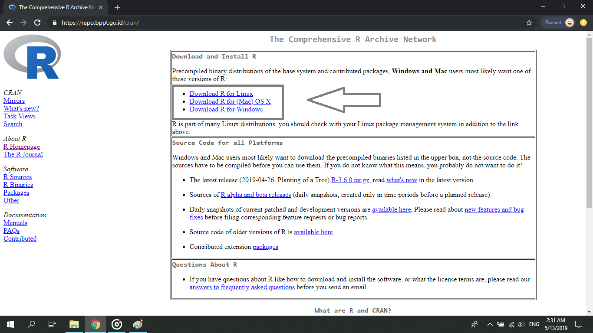
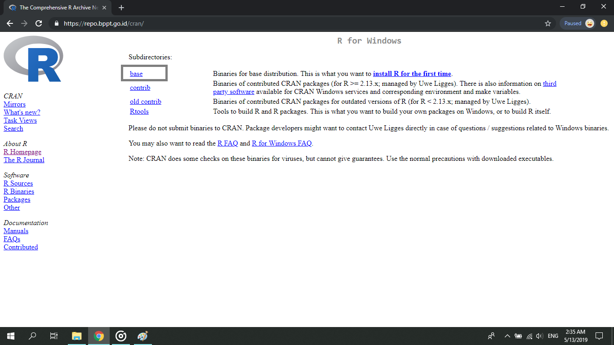
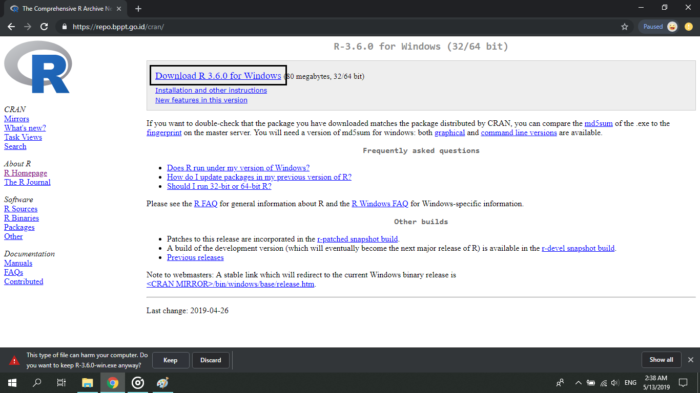
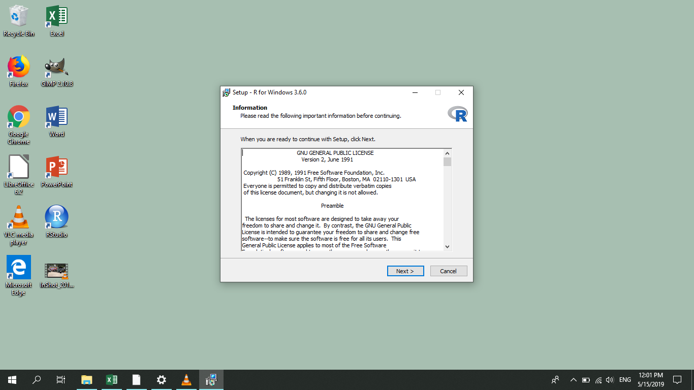
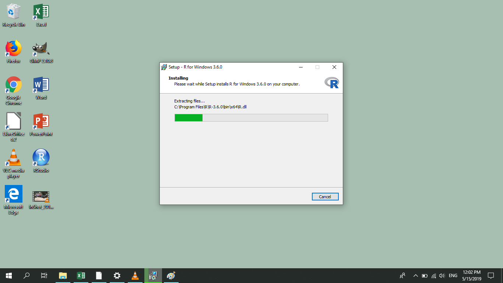
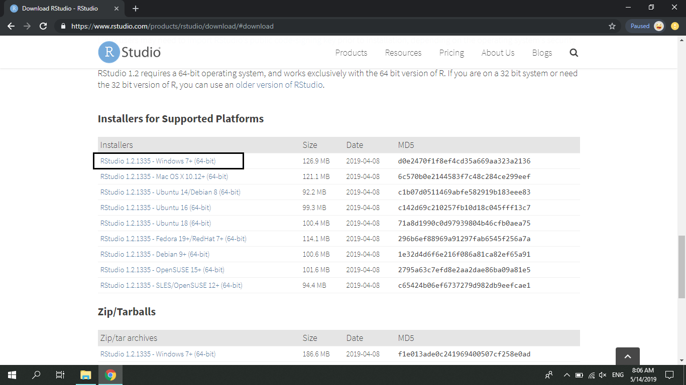

# Bahasa Pemrograman R {#R}

## Apa itu R?

[R](https://www.r-project.org/) adalah sebuah bahasa pemrograman yang digunakan untuk melakukan *data analysis* atau *data science*.
R diprakarsasi oleh Ross Ihaka dan Robert Gentleman sebagai bentuk *open source* dari S, salah satu bahasa pemrograman statistik juga.
Di masa kini, R banyak digunakan dalam hal *data science* atau *data analysis* sebab sifatnya yang *Free* dan *Open Source* memudahkan siapapun untuk membuat *package* untuk R.
File R berbentuk *script* atau *text*.
Bentuk ini memudahkan  pengguna R untuk mereproduksi atau replikasi dengan cara yang sederhana (read: *copy-paste*).
Hadley Wickham -- salah satu orang paling populer di dunia R -- membuat proses dilakukannya *data analysis* atau *data science*.
Salah satu proses tersebut adalah visualisasi.
Bentuk file R yang merupakan teks akan mempermudah proses ini.

## Pemasangan R

### Windows 10 {-}

Cara terbaik untuk mengunduh R adalah dengan menggunakan situs resminya yaitu https://www.r-project.org/. Dari situs tersebut, akan diarahkan menuju *mirror* terdekat.
Indonesia memiliki mirror terdekat yaitu milik Badan Pengkajian dan Penerapan Teknologi (BPPT).

1. Untuk mempermudah, silahkan menuju tautan https://repo.bppt.go.id/cran/.
1. Setelah halaman terbuka, klik pada bagian *Download R for Windows*
1. Kemudian akan muncul halaman baru, klik pada tautan *base*
1. Setelah halaman baru muncul, klik pada tautan *Download R 3.6.0 for Windows*.
1. Setelah selesai mengunduh R, double pada file *executable* (*.exe*).

Proses pemasangan R merupakan proses mudah, pembaca hanya perlu klik tombol *Next* atau *OK* pada setiap jendela dialog.

```{r install-r-1, fig.cap='Repository R dari BPPT', echo=FALSE}

```

```{r install-r-2, fig.cap='Klik pada tautan base', echo=FALSE}

```

```{r install-r-3, fig.cap='Klik pada Download R 3.6.0 for Windows', echo=FALSE}

```

```{r install-r-4, fig.cap='Kotak dialog untuk R', echo=FALSE}

```

```{r install-r-5, fig.cap='Kotak dialog terakhir setelah tomboh *Next* dan *Ok* dipilih', echo=FALSE}

```

Untuk mempermudah pengerjaan menggunakan R, digunakan program Rstudio IDE.
Berikut adalah cara mengunduh Rstudio

1. Pergi ke tautan https://www.rstudio.com/products/rstudio/download/
2. Cari tulisan "Installers"
3. klik pada Rstudio 1.2.1335-Windows 7+ (64-bit)

Memasang Rstudio IDE juga sama mudahnya dengan memasang program R.

```{r rstudio-install, echo=FALSE, fig.cap="Halaman Unduh Rstudio", eval=FALSE}

```

### Ubuntu 18.04 {-}

Pengguna Ubuntu 18.04 dan Linux secara umum memiliki kelebihan yaitu dapat menginstall program menggunakan terminal.
Oleh karena itu, untuk menginstall R dan Rstudio, pembaca hanya perlu melakukan **Copy-Paste masing-masing script berikut secara baris per baris di terminal.**

1. Unduh dan pasang R

```{sh, eval=FALSE}
sudo add-apt-repository 'deb https://cloud.r-project.org/bin/linux/ubuntu bionic-cran35/'
sudo apt-key adv --keyserver keyserver.ubuntu.com --recv-keys \
E298A3A825C0D65DFD57CBB651716619E084DAB9
sudo apt update
sudo apt install r-base r-base-dev
```

2. Unduh dan pasang Rstudio

```{sh, eval=FALSE}
sudo apt install gdebi
wget https://download1.rstudio.org/desktop/bionic/amd64/rstudio-1.2.1335-amd64.deb
sudo gdebi -i rstudio-1.2.1335-amd64.deb
```

## Penggunaan R

### Kalkulator

R pada bentuk sederhananya dapat dianggap sebagai sebuah kalkulator.
Kita dapat melaukan operasi dasar seperti 2 + 2 = `r 2 + 2`.

```{r operasi-dasar}
2 + 2 * 10 / 5 - 10
```

### Menyimpan objek dengan `<-`

Dalam R, hasil dari suatu perhitungan dapat disimpan dalam sebuah objek.
Kita dapat menggunakan tanda `<-` untuk memasukkan sesuatu ke dalam sebuah objek.
Berikut adalah contoh.

```{r simpan-objek}
x <- 2 + 2 * 10 / 5 - 10
y <- 9
z <- x*y

print(z)
```

### string

Selain angka, karakter atau *string* juga dapat disimpan ke dalam sebuah objek.
String dalam R diawali dan diakhiri dengan tanda petik (")

```{r string}
nama <- "Wihelmus Wedo"

nama
class(nama)
```

### Vektor

Vektor dalam R dapat dipahami sebagai sekumpulan angka atau string.
Vektor memiliki sebuah kelas atau *class*.
Maksudnya, vektor dengan kelas *numeric* memiliki isi angka, dan vektor dengan kelas *character* memiliki isi string.
Jika terdapat angka dan string dalam suatu vektor, maka vektor tersebut menjadi vektor string.
Vektor dapat dibuat dengan menggunakan `c()`.

```{r vektor}
angka <- c(1, 2, 3, 4, 5, 6)
karakter <- c("a", "b", "c")
coba_ini <- c(1, 2, "tiga")
```

Selain *numeric* dan *character*, terdapat juga kelas lain yang merupakan pengembangan.
Dari kelas *numeric*, pengembangannya berupa

1. *integer*, yaitu vektor dengan bilangan bulat.
2. *double*, yaitu vektor dengan bilangan riil.

Sedangkan dari kelas *character*, pengembangannya berupa

1. *factor*, yaitu vektor dengan adanya urutan pada elemen.
2. *date*, yaitu vektor dengan pengembangan untuk penanggalan kalender.

Secara umum, pengguna R disarankan untuk menggunakan kelas vektor yang tepat.
Sebagai contoh, angka seperti 1, 2, dan 3 disimpan dalam vektor *integer* dan tanggal di dalam vektor *date*.
Penggunaan yang keliru seperti memasukkan sebuah tanggal ke dalam vektor angka atau memasukkan bilangan riil ke dalam vektor *factor* dan lain-lain, dapat memberikan hasil yang membingungkan.

```{r vektor-kelas}
class(angka)
class(karakter)
class(coba_ini)
```

### Tabel atau *data frame*

Pekerjaan di BPS biasanya dilakukan dalam sebuah tabel.
Di dalam R, tabel lebih dikenal dengan nama *data frame*.
Tabel atau *data frame* merupakan satu tingkat di atas vektor.
Tabel memiliki baris dan kolom.
Kolom dalam sebuah tabel merupakan sebuah vektor.
Dapat dikatakan bahwa tabel merupakan kumpulan vektor yang memiliki panjang yang sama.
Berikut adalah salah satu *data frame* bawaan dari R.

```{r tabel}
head(beaver1)
```

